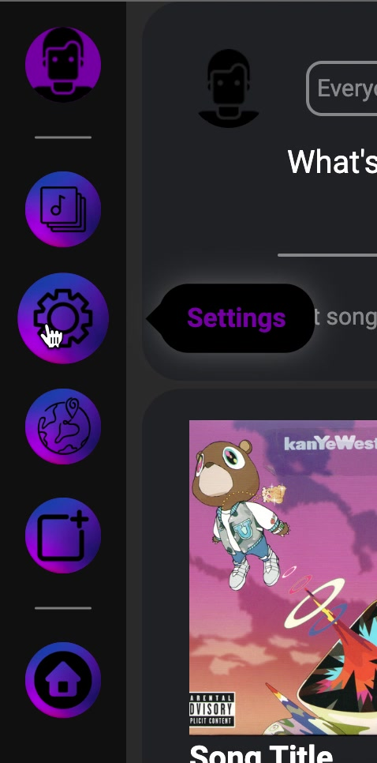
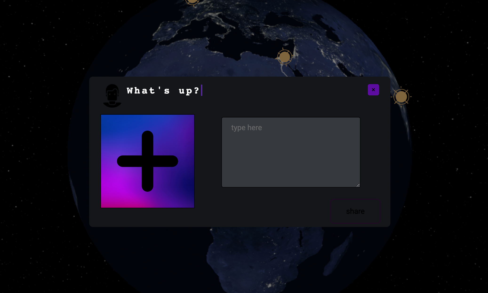

# COMP3020 - Milestone 3 - Group 5

## Technology Overview

The Technologies used in Ratune include: JavaScript, HTML, CSS. Essentially, we used the vanilla web development tools. This was to keep the program as lightweight as possible to allow it to run on anyone's machine. Although, we used a library called [Three.js](https://threejs.org/) to develop the 3D model of Earth found on the Explore page. We placed the library's dependencies within our repository so the user would not have to install anything or wait for the library to load through the Internet. Our approach to developing this platform was to build everything in components and bring it all together when we were satisfied with each component. Each component, such as the navigation bar, was build independently and then was placed in a position that satisfied our design. As a team, we divided the components needed and each person developed their assigned piece of the program. We held meetings to ensure design philosophy was consistent.

## Design Deviations and Evolutions

We had some deviations from our orignial design based on our classmate's and friend's suggestions. When we were showing our platform to classmates they noted the colours did not contrast well enough, we adjusted our colour scheme to make our platform more visually appealing though the use of contrast. Users also had said that the main feed page needed an option at the very top to create posts. We took this idea and generated a post element at the top of the main feed. We also decided that the posts would look better if the posts were cards with some spacing between them, rather than blocks on top of one another. As well, we redesigned the posts to give more focus to the user generated caption. On the Explore page, we wanted the ability to enlarge the pop-up and allow the user more access to that region's music. We were unable create this element due to the music data needed to generate this. Overall, the design from our initial high-fidelity drawings were quite consistent with our finished product.

## Usability "Sales Pitch"

### Visibility

 - The posts are structured using similarity and symmetry for the user to recognize the pattern seen on many platforms. This is designed to enhance their familiarity with our program.

 - In the Playlist view, we use closure to make the distinctions between the differing types of playlists. We also incorporate proximity to show the user that these playlists are part of the same grouping.

### Feedback

 - We used area with our pop ups to bring the user's focus to the icon they have clicked. We bring the figure to the foreground and blur the background.

 - We made core navigation functions available as a side bar that allows the user to navigate the platform. Using clear icons and a pop-up name that describes the page when the user hovers over the button. This pop up gives the user feedback in where they are navigating to. We display to the user the current page they are on by a small high contrast element next to the button corresponding to the current page.

### Mapping

- In the Explore page, the rotation of the Earth is very similar to rotating a globe in real life. This gives the Explore page a high degree of compatibility.

### Consistency

- We have a consistent graphical expression throughout the website. As well as the consistent view of both the navigation bar and music player. This allows the user to quickly adapt to our platform and understand functionalities with little confusion.

### Simplicity

- Each page has functions that are related to it without any excess use of controls that may confuse the user.

### Recovery from Errors

- Every function has a way back or a close button associated with it. This allows our users to never feel trapped somewhere in the platform. We see this with the close buttons that use contrast so it is easily distinguished.

